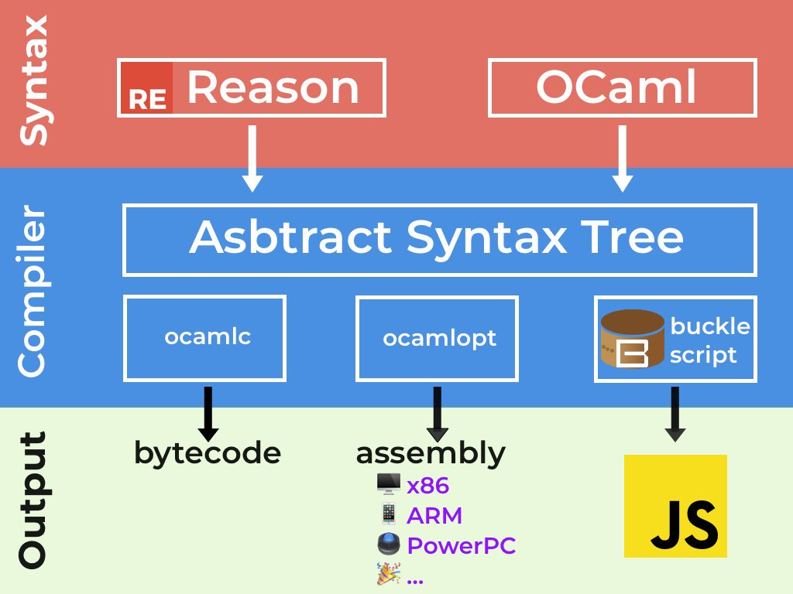

# Learn ReasonML Workshop

## What is reason? 
  Reason is not a new language; it’s a new syntax and toolchain powered by the battle-tested language, OCaml. Reason gives OCaml a familiar syntax geared toward JavaScript programmers, and caters to the existing NPM/Yarn workflow folks already know.

  In that regard, Reason can almost be considered as a solidly statically typed, faster and simpler cousin of JavaScript, minus the historical crufts, plus the features of ES2030 you can use today, and with access to both the JS and the OCaml ecosystem!

## Why reason?
 - *A rock solid type system.* - OCaml types have 100% coverage every line of code!

- *An eye for simplicity & pragmatism.* -  We allow opt-in side-effect, mutation and object for familiarity & interop, while keeping the rest of the language pure, immutable and functional.

- *A focus on performance & size.* - Reason's build system, bsb, finishes building in less than 100ms (incremental).

- *Incremental learning & codebase conversion.* - Reap the benefits of a fully typed file from day one. If everything else fails, paste some raw JavaScript snippets right in your Reason file.

- *Great ecosystem & tooling.* - Use your favorite editor, your favorite NPM package, and any of your favorite existing stack. 

## ReasonMl ecosystem in a nutshell:



## Disclaimer

ReasonML is a new syntax for an old language - OCaml. Facebook reports [using it in production](https://reasonml.github.io/blog/2017/09/08/messenger-50-reason.html) for the Messanger app, and are trying to actively grow and support the ReasonML community. They even have an [annual conference](https://www.reason-conf.com/). 

With all the hype, excitement and true value that OCaml language features provide, the ecosystem is still very young, documentation is sometimes partial, lacking or depricated, and there's a good chance you'll find yourself in need of libraries or tools that don't yet exist. Like all languages, ReasonML / OCaml has its fair share of baggage.

That being said, we believe that learning a language from the ML family (ML, F# OCaml, ...) will make your a better developer, whether you'll use it in production or not. 


# Table of Content

1. [Prerequisites](#Prerequisites)
1. [Workshop](#Workshop)
    - Goals
    - How to
1. [Additional information](#additional-resources)
    - More Coding
    - Starting a project from scratch
    - Links
    - Credits
    


# Prerequisites

This workshop is intended for and has been tested with VS-Code to work out-of-the-box.

If you want to use `vim` or `WebStorm` - Awesome! After the workshop figure out how to configure your optimal setup.

* Install [VS Code](https://code.visualstudio.com/download)
* Install the [reason-vscode](https://marketplace.visualstudio.com/items?itemName=jaredly.reason-vscode) plugin


## TL;DR : Editor Plugin

Currently there are two common extensions to choose from:
  * [reason-vscode](https://marketplace.visualstudio.com/items?itemName=jaredly.reason-vscode)
  * [OCaml and Reason IDE](https://marketplace.visualstudio.com/items?itemName=freebroccolo.reasonml)

We recommend installing `reason-vscode`:
  * It's the one stated in the official [ReasonML docs](https://reasonml.github.io/docs/en/editor-plugins#officially-supported-editors)
  * It's installation process seems simpler and with less dependencies
  * It is being actively 

Just add the extension to VS Code and should work out of the box. We highly recommend setting your editor's `formatOnSave` settings to `true` (In User Settings).


# Workshop

## Goals

  - General understanding of the ReasonML ecosystem
  - Experience hands on some of the super productive features 
  - Have fun!

## How to

This repository includes a `workshop-chapters` folder which contains, well, all the chapters for the workshop. The chapters are self-contained, fully documented and have tests at the end. Simply start at `ch01` and work your way through.

Since Reason is a compiled language, you need to compile your code before running tests. We recommend running `npm start` to have compilation run everytime your `.re` files change.

For ease of use, test your code by running `npm test`.

  


# Additional Resources

## More Coding!

If you've finished the workshop and want some additional coding challenges, we gathered together a few things you can do. Just take a look in the `more-coding` folder.

        
## How to start a project from scratch

If Reason really tickled your fancy and you want to start your own projects from scratch, here's a fast minimal way of doing it. Starting a new project has a few caviats and documentation changes often. Hopefully this section of the README will become redundant as the community fixes these issues.

### Short version:

```bash
mkdir my-new-reson-project
cd my-new-reson-project
npm i --save-dev bs-platform
./node_modules/.bin/bsb -init . -theme basic-reason
```

**Note:** to get much nicer error messages, add the following to your `bsconfig.js`: 
```json
  ...
  "bsc-flags": ["-bs-super-errors"]
}
```

### TL;DR

#### *What's the deal the the pretty error messages?* 
read [here](https://reasonml.github.io/blog/2017/08/25/way-nicer-error-messages.html)

#### *What's the deal with the weird installation process?* 
The official installation process recommends install `bs-platform` globally, and `bsb -init` creates a symlink to the global installation. In order to avoid weird setup conditions and version conflicts, this installation process makes sure to use the `bs-platform` which is locally installed in your project.


## Links

There is a lot of basic material we did not cover in this workshop, and there's a lot to know. Probably everything you need to know is at one of the following sites:

* [ReasonML website](https://reasonml.github.io/)
* [BuckleScript website](https://bucklescript.github.io/)


## Credits 

This workshop is heavily based on [protoship/learn-reasonml-workshop](https://github.com/protoship/learn-reasonml-workshop) which is based on [a workshop organized by Jane Street](https://blog.janestreet.com/learn-ocaml-nyc/) for teaching OCaml.
